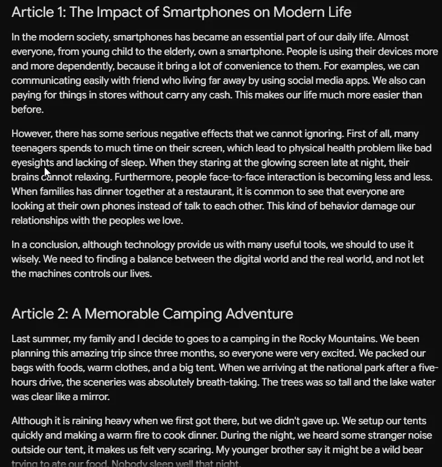

# EasyChat

[English](README_en.md) | [简体中文](README.md)

  
  
  

EasyChat is a desktop translation and language-assistance tool. The current release supports Windows. It handles images, text, and audio, with additional tools for polishing, summarizing, grammar correction, and live translated subtitles.

## Installation

1. Download the latest release from [GitHub Releases](https://github.com/SwaggyMacro/EasyChat/releases).
2. The recommended option is `EasyChat-Win-<version>-Setup.msi`, which creates the appropriate shortcuts.
3. You can also download `EasyChat-Win-<version>-Portable.zip`, extract it, and run `EasyChat.exe` without installation.

On first launch, connect a translation service in Settings. Screenshot OCR and live speech recognition also require their corresponding local models; see the [Quick Start guide](https://easychat.ncii.cn/en/docs/quickstart) for details.

## Features

- **Screenshot translation**: Capture text from a page, video, image, or application and translate it. OCR supports 80+ languages.
- **Screenshot OCR**: Extract text from images for copying, translation, and explanation.
- **Selection toolbar**: Work directly beside selected text to translate, polish, or correct it.
- **Typing translation**: Translate text and write it back into the active input field.
- **Quick translate**: Translate typed or selected text on demand.
- **Polish, summarize, and correct**: Improve writing, condense content, and review grammar explanations.
- **Live speech recognition**: Turn system audio into bilingual floating subtitles for videos, streams, meetings, and classes.
- **Simultaneous interpretation**: Translate microphone input and output speech.

## Demo

### Screenshot translation

### Selection toolbar

### Quick translate

### Live speech recognition

https://github.com/user-attachments/assets/d17d6287-7cc4-40e4-a322-3c4fed615bda

See the [project homepage](https://easychat.ncii.cn/en) for more demos and interactive feature previews.

## Documentation

- [English documentation](https://easychat.ncii.cn/en)
- [Quick Start](https://easychat.ncii.cn/en/docs/quickstart)
- [Download and Install](https://easychat.ncii.cn/en/docs/installation)
- [Translation Sources](https://easychat.ncii.cn/en/docs/engine)
- [Features](https://easychat.ncii.cn/en/docs/feature)
- [Settings Reference](https://easychat.ncii.cn/en/docs/settings)

EasyChat is open source. Issues and pull requests are welcome on [GitHub](https://github.com/SwaggyMacro/EasyChat).
